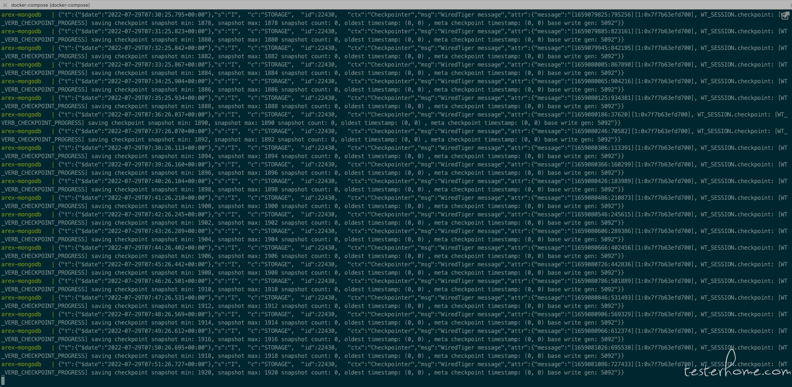
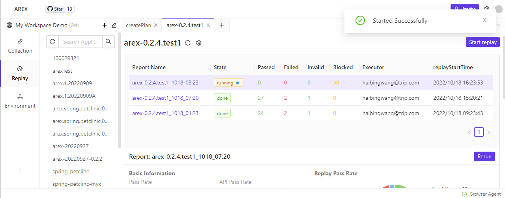
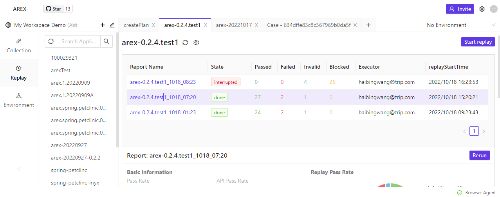
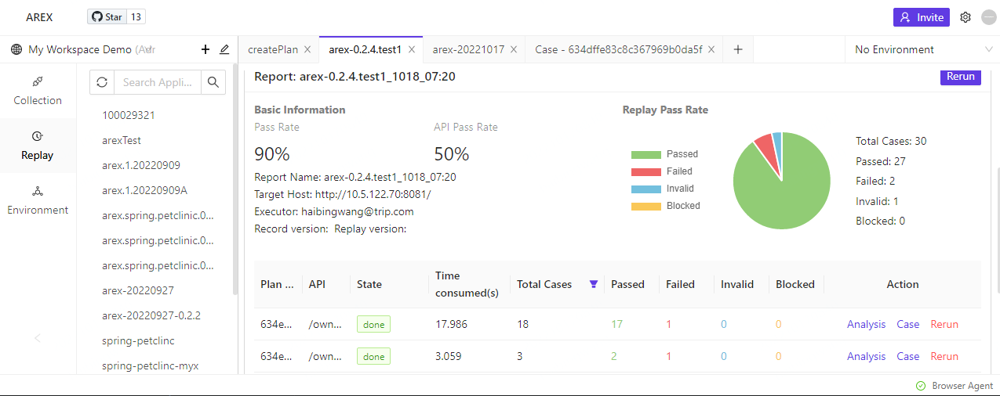

## Beginner's Guide

[Thanks to TesterHome: imath60 for "A Brief Talk on Getting Started with AREX", visit the original text and click me](https://testerhome.com/topics/33978)

### Background introduction
In the whole life cycle of the business, set quality check points on the release PipeLine, automate regression testing [interface + link], ensure the quality of the two dimensions of interface and link, control the release quality, and keep the last line before going online line of defense. This article will introduce the RECORD, REPLAY & DIFF capabilities of the AREX-based interface.

### Beginner's Guide
#### AREX deployment
````
git clone git@github.com:arextest/deployments.git
cd deployments
docker-compose up
````
  
Successful deployment effect:


#### Compile AREX-AGENT
````
git clone git@github.com:arexest/arex-agent-java.git
mvn clean install
````

Compilation success effect:


#### Inject AREX-AGENT into the service under test to complete the recording
````
java -javaagent:./arex-agent-0.1.0.jar
     -Darex.config.path=./arex.agent.conf
     -jar spring-petclinic-2.7.0-SNAPSHOT.jar
````

Injecting the startup success effect:


### Playback and DIFF using AREX-UI

#### Start playback


#### playback execution


#### Playback results


#### Playback report


### Optimization suggestions
1. Priority is given to improving the construction of the documentation system, including but not limited to deployment documentation, usage documentation, development documentation, etc.;
2. The deployments and the demo project integrating arex-agent are continuously improved, striving for out-of-the-box use to reduce the impact of initial blockage due to incomplete documentation and start-up problems;
3. Start the localization of arex-ui, and update Chinese & English synchronously.

### Future Outlook
1. Based on arex's interface traffic recording & playback capabilities, combined with manual interface interface test scripts to create interface quality verification capabilities;
2. Combined with the transparent transmission of the spanid and traceid recorded by the interface traffic, the transparent transmission of the link dimension is completed, and combined with the existing manual-based scenario use cases to create the link quality verification capability;
3. Associate the above capabilities with automated test task sets, and combine accurate testing and code coloring to build a positive and negative two-way traceability system. Based on code changes, the scope of changes and the scope of influence are given, and automated test case sets are recommended and executed, and the code is colored according to the code. Calculate the change and impact coverage rate, combined with the quality card point threshold of the release pipeline, to support release decisions.