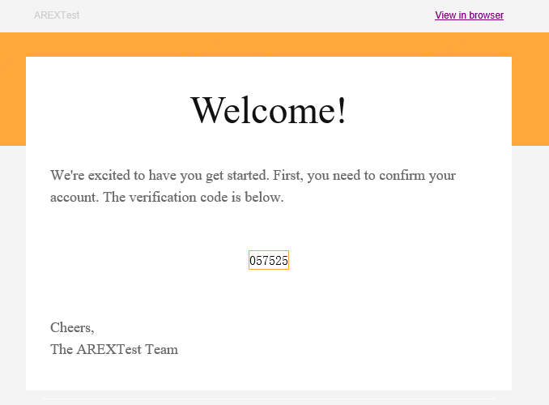
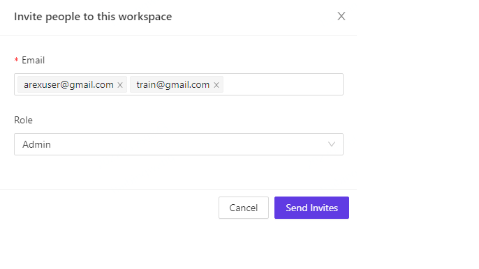

# Getting started
After the AREX service is installed, you can access the AREX front-end through the browser, and execute the use case configuration execution through the AREX front-end.
Record playback records and reports, manage use cases and test results, etc.

## Interface introduction
After the installation is complete, access it through a browser (assuming the server address is 10.5.153.1)
* If the port configuration is not modified, directly access port 8088 (DockerCompose exposes port 8088) http://10.5.153.1:8088/
* If the front end is deployed independently, and the port is not modified (default port 8080) http://10.5.153.1:8080/
* If the port is modified, access it according to the modified port

### Interface composition

Contains the following areas
* Menu area, Collection menu (view common use cases and comparison test cases), Replay menu (access AREX recording and playback use cases), Environment (environment configuration)
* The workspace area, above the menu area, is where the workspace is displayed and configured. The workspace is where the collection of user use cases is stored. Each user can configure/delete the workspace, and add/display/configure/delete/execute test cases in the workspace
* Work area, main function area, place to display and operate AREX operation functions
* In the upper right, invite button (invite others to participate in a Workspace, work together) and setting button (set dark mode/bright mode)

### Chrome plugin
* Recommended browser Chrome access
* If you can access the Chrome plug-in, when accessing the AREX interface, follow the browser prompts to install the plug-in
* When you can't access the Chrome extension, please download and install it locally, [Release link](https://github.com/arextest/arex-chrome-extension/releases)

### First login

* You need to enter your personal email address, which is mainly used to identify the uniqueness of the current user
* You can also log in directly with the "guest" link below, but the guest does not have the invitation function after login (that is, the use case sharing function)
* After receiving the verification code by email, click Login to log in

### New workspace

Enter the workspace name and confirm

### Invite others (TODO, this feature is temporarily unavailable)

Invite others to participate in the current Workspace by sending an email
After the user refreshes the interface after being invited, the workspace will be displayed in the workspace area in the upper left corner of the user. The user can select this WS, view the use case and operate it, etc.

## Workspaces

### New Collections

* Add collections to root
* Collection can be added again in Collections, and the containment relationship can be set according to user needs without restrictions
* Add Request in Collection (unit of API interface, a specific interface)
* Management operations on Collection, including adding, configuring, deleting, etc.
Operation interface example
